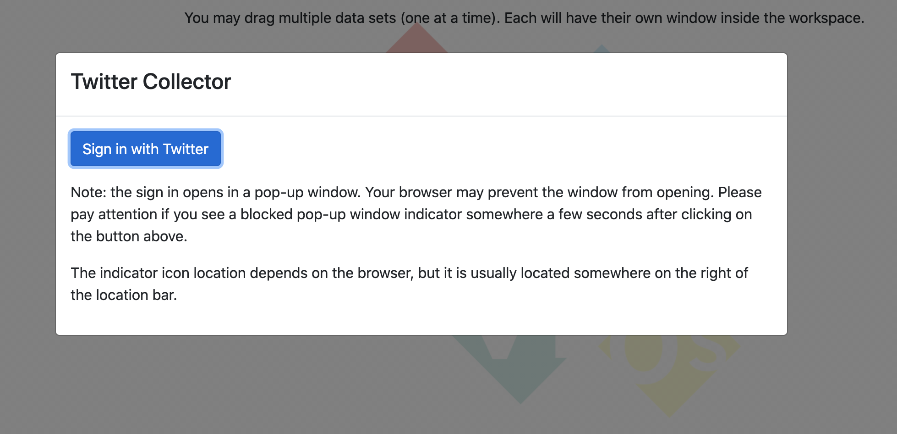
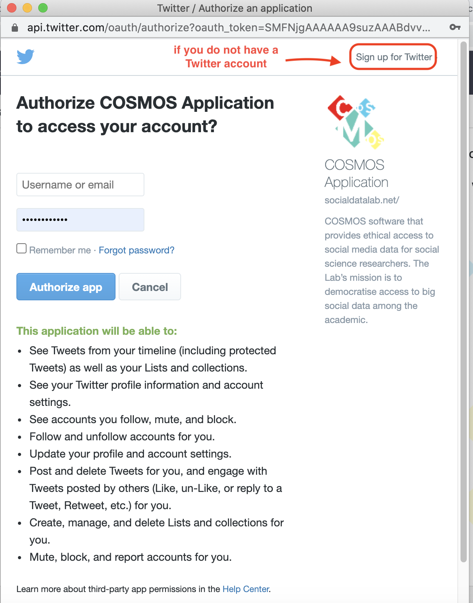
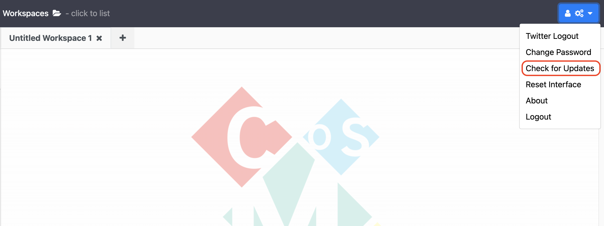

# Lessons

## 1) Authorising your Twitter Account
After installing and setting up the COSMOS Desktop, here we will authorise your Twitter account before starting a collection:
1. Click the plus button on the top left corner (in the show panel).
2. Choose the *'Start Twitter Collection'* option from the dropdown list.
3. Click the *'Sign in with Twitter'* button on the pop-up window. 

    {:height="250px" width="500px"}

4. Fill the form with your Twitter username and password and click the *'Authorize app'* button. If you do not have a Twitter account, you can sign up for Twitter by clicking the *'Sign up for Twitter'* on the top right corner of the page.

    {:height="500px" width="400px"}

5. After seeing the 'login was successful' message, you will see the Twitter Collector pop-up window that means COSMOS is ready to start collection.

    {:height="500px" width="500px"}



## 2) Check for Updates
Cosmos active development will receive updates. Once you install COSMOS on your computer, you do not need to reinstall COSMOS to receive new updates. Since COSMOS is in active development, we developed a feature to enable you to get the latest version of COSMOS. Before using the COSMOS each time, click on the menu button on top right of the page and click on the *'Check for updates'* option. 
{:height="300px" width="600px"}

If there is a new version, click on the 'yes' option so you can upgrade to the latest version of the COSMOS. To use the latest version, you need to restart COSMOS application.  
**ADD SCREENSHOT**

***  
#### You can also watch youtube video clicking the image below for all data collection process with COSMOS.
***

<iframe width="560" height="315" src="https://www.youtube.com/embed/DMJGaqZNNWY" title="YouTube video player" frameborder="0" allow="accelerometer; autoplay; clipboard-write; encrypted-media; gyroscope; picture-in-picture" allowfullscreen></iframe>

> ## Exercise
> 1) Perform steps to authorise your Twitter account for tweets collection.
>
> 2) Check for updates before using COSMOS. Did COSMOS automatically restart?
{: .challenge}
