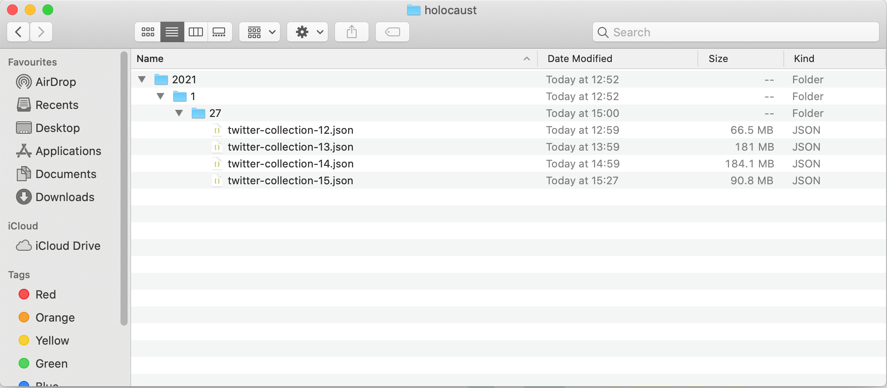
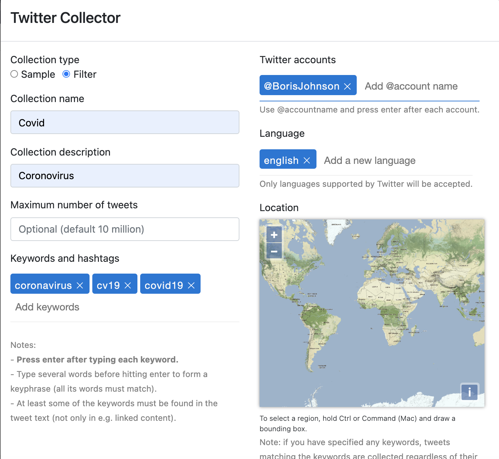
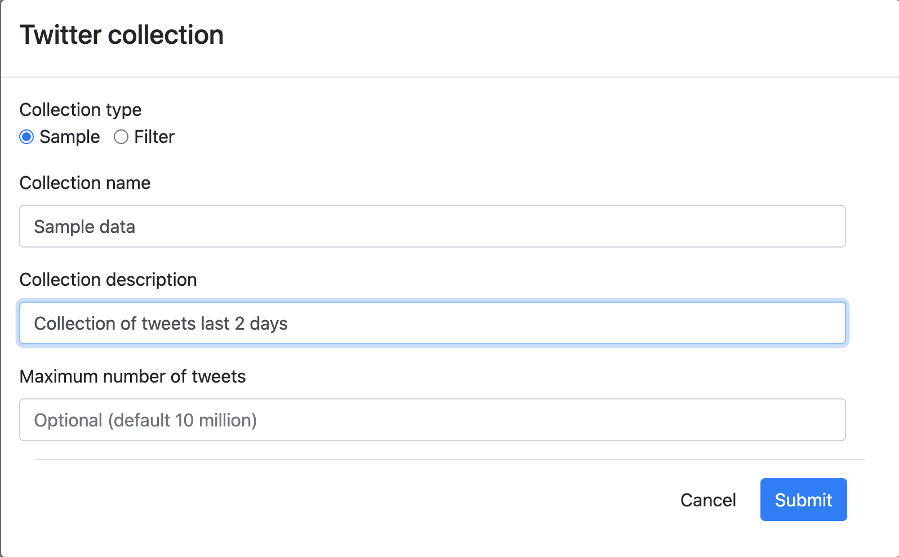
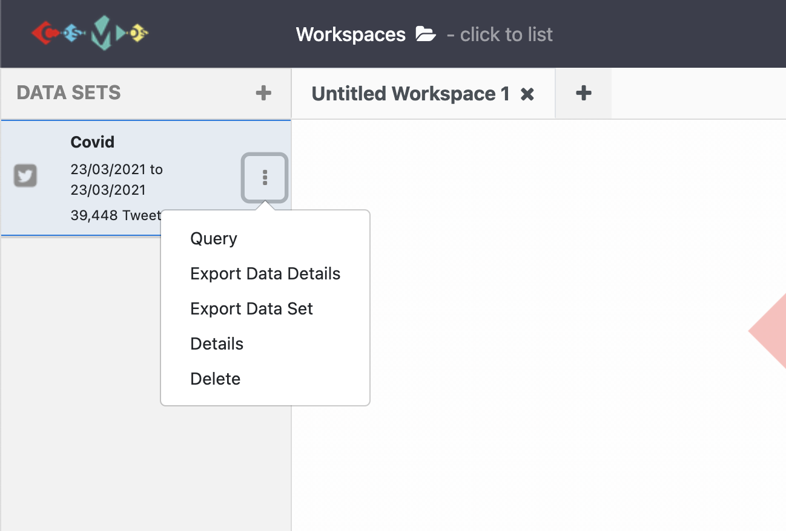

## Before We Start
- Setup COSMOS.
- Authorise your Twitter account to collect data.
- Check if there is an update.

# Lessons
***
## 1) Collection Process

The Twitter API allows COSMOS to stream public Tweets from the platform in real-time. COSMOS uses filtered stream endpoints to narrow criteria you defined from the COSMOS interface such as `keywords`, `hashtags`, `account names`, `language`, `place`(see the *Data Collection Screen* section). To get more information about filtering realtime tweets, follow the link below:
<https://developer.twitter.com/en/docs/twitter-api/v1/tweets/filter-realtime/guides/basic-stream-parameters> 

Creating a filter is helpful because it prevents you from collecting unwanted tweets for your research.

After you start a collection through COSMOS, you will begin receiving a stream of data. All streamig data is saved in JSON format in the `/home/COSMOS-files/tmp` folder temporarily. For each collection, COSMOS creates a folder which has the same name with the collection in the `tmp` folder. Folder structure:

`<%collection_year%>/<%collection_month%>/<%collection_day%>/twitter-collection-<%hour%>.json` 
{:height="300px" width="600px"}

Since COSMOS does not show all entities from the raw streamed data in it's interface, the temp files could be beneficial if these need to be accessed. Later, COSMOS creates a local database on your machine and moves the dataset to the database from the *'tmp'* folder.

## 2) Data Collection Screen
After setting up COSMOS on your machine, you can start the software as instructed. 

Once COSMOS is launched in your browser, click the plus button on the top left corner. You will see the options `Import Data`, `Import RSS Feed` and `Start Twitter Collection`. You can generate a Twitter collection by filtering or sampling:

**Filter:**
COSMOS provides a filtering feature to narrow a collection while streaming data from Twitter.
1. Click `Start Twitter Collection`.
2. Choose the collecting type as `Filter`.
3. Give an appropriate name for the collection on the `Twitter Collector` pop-up window.
{:height="500px" width="500px"}

4. Start the collection based on filtering criteria: `Keywords and hashtags`, `Language`, `Location`, `Twitter accounts` and `Maximum number of tweets` by filling the form.
5. While filling the `Keywords and hashtags`, `Twitter accounts` and `Language` sections, you should press `Enter` after typing each entry. Once you press `Enter`, it should turn blue. 

{:height="450px" width="550px"}

6. When the form is filled, click the submit button. Once the collection starts, it appears on the show panel.
{:height="250px" width="500px"}

> ## Tip:
>
> 1. When you enter multiple keywords, hashtags or accounts when filtering the collection, the Twitter API determines which results to return using logical OR. For example; 
> If you start a collection with keywords `covid`, `vaccine` and `coronavirus` and Twitter account `@BorisJohnson`, you would get;
> - tweets posted by Boris Johnson (they do not have to be related to covid),
> - tweets contains `covid`, `vaccine` or `coronavirus` keywords. 
> 2. Unlike keywords, hashtags and accounts, the `language` search term uses logical AND. If we add an English
> language filter for the example collection above, you will get only English tweets with the keywords or accounts. 
>
> You can learn more about this at <https://developer.twitter.com/en/docs/twitter-api/v1/tweets/filter-realtime/guides/basic-stream-parameters>
>
{: .callout}

**Sample:**
COSMOS can stream tweets without any filter or specification.
1. Click `Start Twitter Collection`.
2. Choose the collecting type as `Sample`. 
3. Specify the `Collection name`, `Collection description` and `Maximum number of tweets` click the `Submit` button.
{:height="300px" width="500px"}
4. Once you click, the sample dataset will appears on the showpanel.

> ## 3) More on Collections
>
> The collection takes time as it streams tweets in real-time.    
> **While the collection continues**, clicking the three dots on the show panel:
> * Stop the collection when enough data has been collected.
> * **Snapshot** the collection to create a subset consisting of data which has been collected until the snapshot.
> {:height="250px" width="400px"}
> 
> **When the collection has been stopped**, clicking the three dots on the show panel: 
{:height="250px" width="350px"}
> * **Query:** You can filter your collected data based on `tweets sentiment`, `date`, `gender`, `language` and `country`.
{:height="300px" width="400px"}
> When you query the dataset, it creates a subset of the data based on the query details. This feature helps to remove noisy data and shorten the data analysis process. 
> * **Export Data Details**
> * **Export collected data:** Exports collected data as a CSV file.
> * **Delete**
> * **Details of data set:** Exports the dataset's details as a json file e.g. date started, name of the collection, ...
>
>
>
{: .callout}

  
***  
#### You can also watch a YouTube video for all data collection processes with COSMOS by clicking the image below.
***

<iframe width="560" height="315" src="https://www.youtube.com/embed/FfkSW46scLM" frameborder="0" allow="accelerometer; autoplay; clipboard-write; encrypted-media; gyroscope; picture-in-picture" allowfullscreen></iframe>

> ## Tip:
>
> - A maximum of two data collections can be started simultaneously because of Twitter API rate limits. You can learn more about rate limits
> <https://developer.twitter.com/en/docs/twitter-api/v1/tweets/filter-realtime/guides/basic-stream-parameters>
> 
>
{: .callout}

> ## Exercise
> Collect `10000` english tweets using ``, `` keywords, for ``,`` Twitter accounts using COSMOS 2.0
>
{: .challenge}

> ## Exercise
> While collection continues; 
> 1. Create a subset and give it an appropriate name. 
> Which COSMOS feature did you use for this purpose? 
> 2. Create and name a subset filtering only sentimentally
> `negative` tweets in the `last two days`.
> Which COSMOS feature did you use for this purpose? 
>
> > ## Solution
> > 1. Click 3 dots on the panel and select `Snapshot`. After creating a subset click 3 dots and choose `Details` option from the dropdown menu, edit the name of the subset and hit the `Update` button.
> > {:height="200px" width="400px"}
> > 2.  Click 3 dots on the panel and select `Query`. Then, fill the form on the pop-up window choosing sentiment score as a negative number(between -5 to 0) and entering a date of last two days and click the `Query` button. After creating a subset, click 3 dots again and choose the `Details` option from the dropdown menu, edit the name of the subset and hit the `Update` button.
> {: .solution}
{: .challenge}
