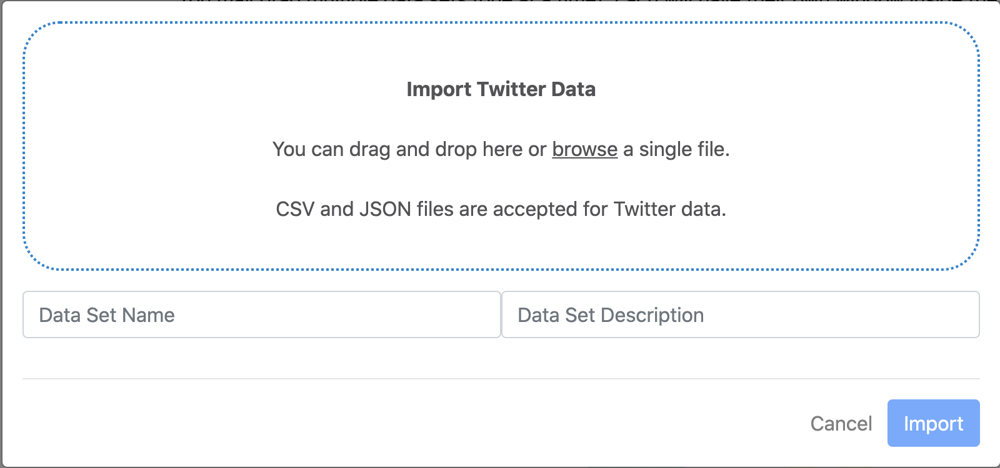
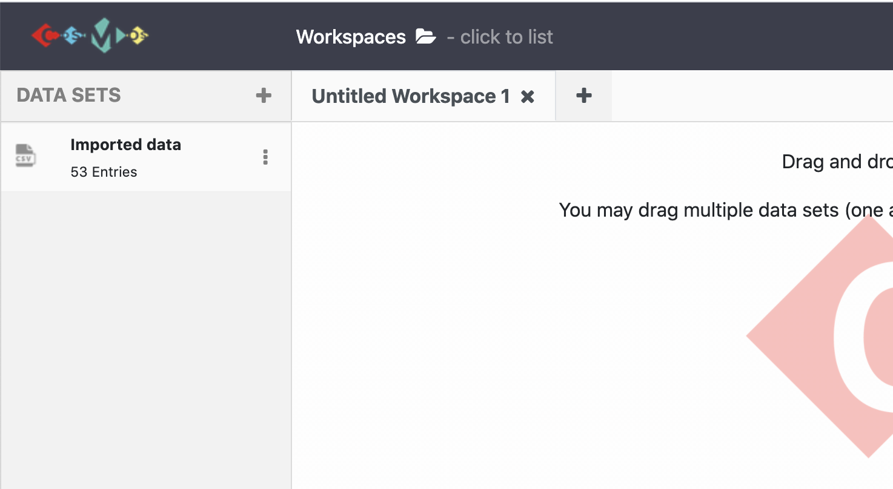

# Lesson
***
After setting up COSMOS on your computer, you can start the software as it is instructed. 

Once COSMOS is launched in your browser, click the plus button on the top left corner. Once, you click the plus, you will see dropdown menu which contains: `Import Data`, `Import RSS Feed` and `Start Twitter Collection` subitems. To import pre-existing data on COSMOS:
1. Click `Import Data`.
2. Choose one of the option `drag and drop` or `browse` to import the single file to COSMOS.
3. Name the dataset and write some explanation by filling the form on the popup window.
{:height="250px" width="500px"}
4. After filling the form and selecting the file, just hit the `import` button.
5. The imported data set appears on the `Show Panel` and it is ready to use.
{:height="250px" width="400px"}

> ## Tip: 
>
> - Only CSV and JSON files are accepted for Twitter data.
> - To be able to visualize and analyse Twitter dataset in COSMOS, dataset has to have these entitites with the same order:
> 'Language_code', 'Timestamp', 'Longitude', 'Tweeet_text', 'Tweet_id', 'Screen_name', 'Latitude'.
{: .callout}

> ## Exercise
> 1. Import and name any pre-existing data on COSMOS following the same steps. 
>
{: .challenge}
