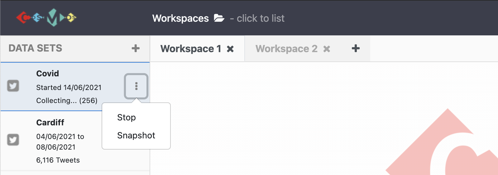

# Lessons
***
## 1. Visualize the Data Collection
Once enough data has been collected or imported using COSMOS, it is time to visualize data to obtain the details and information we are looking for. To start visualization:

1. `Drag and drop` the data collection to the `workspace`
2. Once you drag and drop the data collection to the workspace, `table view` opens automatically. This view provides a quick overview of dataset details for both Twitter entities and the ones identified by COSMOS such as *'gender'*.

{:height="400px" width="750px"}

## 2. Multiple Visualization Views

There are 10 visualization options in COSMOS. When you click the little arrow on the `Table` button (top of the right-hand side of the page), it shows all options (`List`, `Table`, `Text`, `Word Cloud`, `Frequency`, `Network`, `Map`, `Pie Chart`, `Line Chart`)

If you want to visualize the same data collection using more than one option:
- Click the 3 dots button on the right-hand side of the page and choose `Duplicate`.
- When it is duplicated, you can choose one of the visualization options. To do that, click the `Table` button and choose one from the drop-down menu.
{:height="450px" width="750px"}

If you prefer to visualize different datasets, you need to create a new `workspace` by clicking the plus button near the workspace tab on the top of the page. Once you created a new workspace, the visualization steps will be the same. 

#### a) List
For the list view, you can create a list selecting type of meta data. To do that, click the 3 dots in the top of the right-hand corner and choose the `Settings`. Then, choose one of the option you need from the drop-down menu. See the illustration below:

{:height="400px" width="750px"} 
#### b) Text
Text view just demonstrates the text version of the metadata.
{:height="300px" width="750px"} 
#### c) Word Cloud 
For the word cloud view you can;
- select the number of the words that show up on the cloud clicking the little arrow at the top of the left-hand corner,
- (un)select tweets that contain a word by clicking on this word and create a subset dataset,
- exclude tweets that contain a word by `Ctrl(command) + click` on this word and create a subset dataset,
- select the type of metadata you want to illustrate by clicking on `3 dots`. Click `Setting` and select any entity by clicking the radio button. Once you have made a selection, the word cloud will be created based on this entity.
{:height="450px" width="850px"} 

#### d) Frequency
There is a separate lesson for frequency view. (See lesson 6)
#### e) Network
There is a separate lesson for frequency view. (See lesson 6)
#### f) Map

Tweet geospatial metadata has been used to create the map view. COSMOS visualizes geographic data points on the map based on tweet location (if it is specified by the user). The map view can be used to identify hotspots of tweets within the collection. You benefit from this view to monitor and map the spread of social movements such as specific events, occasions, disease outbreaks, etc. 

For the map view you can;
- Visualize geographic data points on the map based on the location of tweets posted.
- To select data points on the map *'Hold Ctrl (Command) and draw a rectangle to (un) select pins'*.
- Create a subset with these selected points.
{:height="400px" width="700px"}
 
#### g) Pie Chart
For the pie chart view you can;
- select the type of metadata you want to illustrate by clicking on `3 dots` and then `Settings`,
- click one of the slices on the pie chart and create a subset for this group.
- see the percentage of each group represents.
{:height="400px" width="800px"}

#### i) Line Chart
For the line chart view you can;
- specify the y-axis of the line chart base on the metadata.
- create multi-line charts to represent and compare more than one series in the dataset. 

***  
#### You can also watch youtube video clicking the image below for all data visualization process with COSMOS.
***

<iframe width="560" height="315" src="https://www.youtube.com/embed/eho0TnYdsos" title="YouTube video player" frameborder="0" allow="accelerometer; autoplay; clipboard-write; encrypted-media; gyroscope; picture-in-picture" allowfullscreen></iframe>

> ## Exercises
>
> 1. Create a pie chart representing `negative sentiments`. Then, create and name a subset data set for the group of tweets that has a sentiment score is '-3'.
> 2. Visualize your data collection using the `Word Cloud` view showing up to 50 words. Then, create and name a subset including one of the most used words in `Twitter text`.  
> 3. Create a multi-line chart representing `positive sentiment` and `negative sentiment`.
{: .challenge}

## 3. Drilling down into data
COSMOS provides many ways to create and visualize subsets regarding research needs.

### 1. Query
After enough data has been collected, clicking the three dots on the show panel you can filter data collection based on `tweets sentiment`, `date`, `gender`, `language` and `country`.
{:height="400px" width="400px"}

### 2. Create a subset from the collection
While the collection continues, clicking the three dots on the show panel, `Snapshot` the collection to create a subset data which has been collected until the snapshot.
> {:height="200px" width="400px"}

### 3. Create a subset from the visualizations
After creating and naming a subset from any visualization view, you can apply the same visualization steps to the subset data you recently created. It allows examining and comparing the data in details. See the video tutorial for this lesson below:

> ## More on Visualizations
>
> Once you create more than one visualization, selecting data in one view highlights the same data for other views. 
> 
> **For example;**
> 
> let's say we created one table view and on pie chart view. When we click on one of the pie chart slices (female one), it highlights 
> female tweets on the Table view.
>{:height="400px" width="800px"}
>
{: .callout}

> ## Tip: 
>
> If it takes too long to create one of the visualization views:
> - Click on the menu icon on the right top corner of the page and select `Reset Interface`.
> - Then, try to create the graph again.
> {:height="200px" width="400px"}
>
{: .callout}

***  
#### You can also watch youtube video clicking the image below for all data analysing process with COSMOS.
***

<iframe width="560" height="315" src="https://www.youtube.com/embed/IRWQeeYj-EI" title="YouTube video player" frameborder="0" allow="accelerometer; autoplay; clipboard-write; encrypted-media; gyroscope; picture-in-picture" allowfullscreen></iframe>

> ## Exercises
>
> 1. Collect `100,000` tweets with the keywords `covid`, `covid19`, `coronavirus`.
> 2. Create a subset for tweets posted from Europe using one of the visualisation methods and call it `Europe`.
> 3. Create another subset from `Europe` for tweets posted by female users and call it `female`.      
>
>
{: .challenge}

