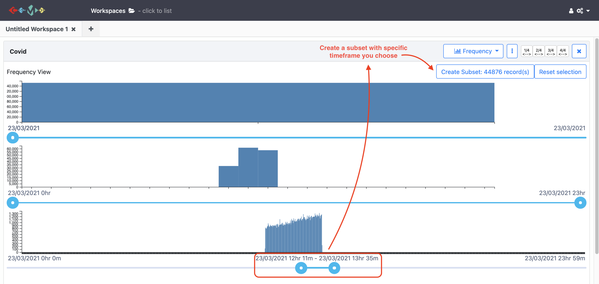
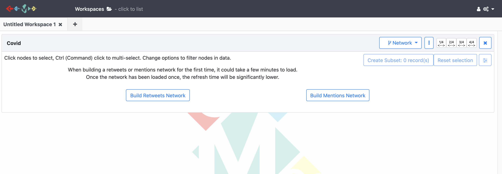
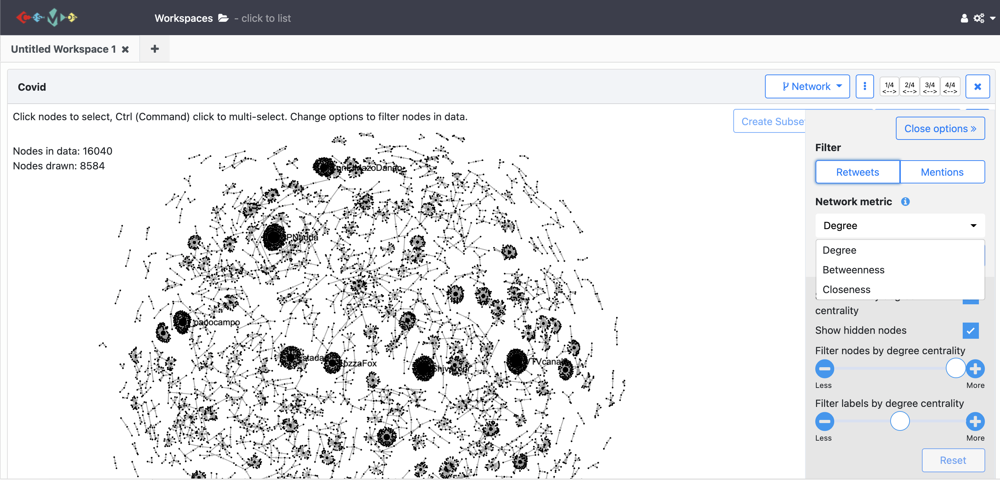

# Lessons
***
## 1. Frequency Analysis
In the frequency view, COSMOS provides 3 frequency analysis on a *daily*, *hourly* and *minutely* basis. You can change the time interval by clicking the continues slider underneath each graph. This view helps to spot tweet spikes over time easily. Chart sliders can be used to create a subset of data around these spike dates.

See the example of frquency view below:

{:height="400px" width="900px"}

## 2. Network Analysis

COSMOS provides network analysis with Twitter data. It can be currently used to visualize `retweets` and `mentions` network. 
{:height="300px" width="800px"}

These network views aim to identify prominent users and their level of influence in the network and how information flows in social media such as thoughts of prominent users on a particular event, topic or product. Both views (retweet and mention)help to visualize the connection and interaction between users. Network graphs can be created based on network metrics `degree`, `closeness` and `betweenness`. It can be selected from the drop-down menu on the right-hand side of the page. COSMOS also gives the filter option to adjust nodes and label visibility on the network chart. Using the sliding chart on the right panel, you can adjust how the network chart looks.   
{:height="400px" width="800px"}

Similar to other views in COSMOS, you can create subset *'Ctrl (Command) + Click'* on multiple nodes to focus on and deeply analyse the network for specific accounts. 

***  
#### You can also watch youtube video clicking the image below for all frequency and network analysis and visualization process with COSMOS.
***

> ## Exercise
>
> Create a subset of a collection that contains at least 2 users that affect the network for a specific event.
>  
{: .challenge}

