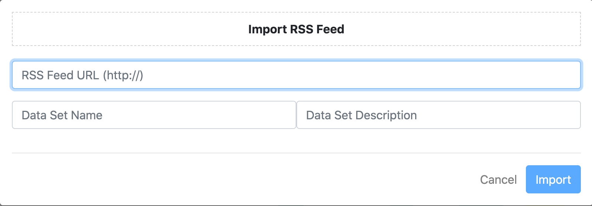
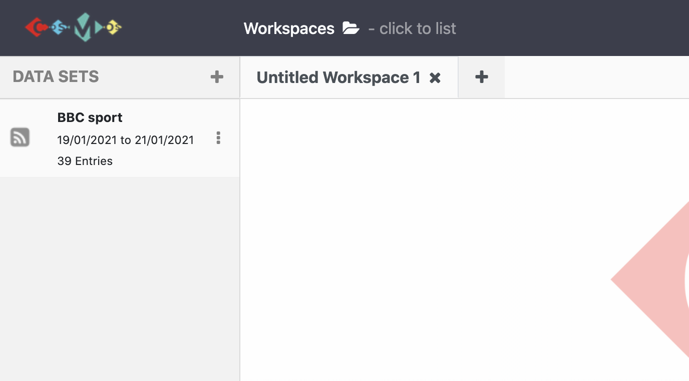

# Lesson
***

### What is RSS Feed?
- RSS Feed is a technology that allows users to access updates to the website in a computer-readable format.
- Websites which publish episodes, news, blog posts or episodes of video series use RSS Feeds.
- With the RSS Feeds users do not need to check websites manually for new content.
- Further information can be found on these links below:

<https://en.wikipedia.org/wiki/RSS#:~:text=RSS%20(RDF%20Site%20Summary%20or,in%20a%20single%20news%20aggregator.>

<https://www.digitaltrends.com/computing/what-is-an-rss-feed/>

Once COSMOS is launched in your browser, click the plus button on the top left corner. There are options `Import Data`, `Import RSS Feed`, `Start Twitter Collection`, and `Import Classifier`. We will import pre-existing data on COSMOS:

1. Click `Import RSS Feed` and the popup window appears on the page.
{:height="200px" width="500px"} 
2. Then, find the RSS Feed URL of the website and `copy and paste` it to the form.
3. Name the dataset and write some explanation by filling the form on the popup window.
4. After filling the form, just hit the `import` button.
5. It set appears on the `Show Panel` and ready to `drag and drop` onto the workspace.
{:height="300px" width="500px"} 

> ## Tip: How to find the RSS Feed URL of a site?
>
> There are some ways to find the RSS Feed URL of a website. You can find out the ways and instructions [clicking this link.](https://help.socialpilot.co/article/503-how-do-i-find-an-rss-feed-url-of-a-site)
> 
>
{: .callout}

> ## Challenge 1
>
> Find the RSS Feed URLs for the following websites and start the collection using COSMOS:
> - BBC Sport
> - New York Times Home Page
>
> > ## Solution to challenge 1
> >
> > - https://feeds.bbci.co.uk/sport/rss.xml
> > - https://rss.nytimes.com/services/xml/rss/nyt/HomePage.xml
> {: .solution}
{: .challenge}

