# How to Setup COSMOS 2.0:

> ## Software
>
> For this lesson you will need to request for **COSMOS 2.0**
> from the Social Data Science Lab website ( 
> [ESRC COSMOS 2.0 Open Data Analytics Software](http://socialdatalab.net/COSMOS)).
> Program files will be downloaded on your machine by clicking the link in the email you will receive.
>
> Note: this is a Java program that runs on the machine you run the installation files. The program has a Graphical User Interface (GUI) that allows you to interact with it from your browser. Web connection is needed for data collection but data exploration and plotting can be done offline. 
>
{: .prereq}

## Mac

### There are two ways to start COSMOS:

#### 1. Starting COSMOS as an application (Recommended one)
- Double clicking the *COSMOS-Installer.dmg* and drag the COSMOS icon over *Applications* shortcut icon. This will copy COSMOS into your Applications folder.
-  Instead of double-clicking the COSMOS application, right-click (Control-click) the file and select *Open* from the context menu. See the illustration below:

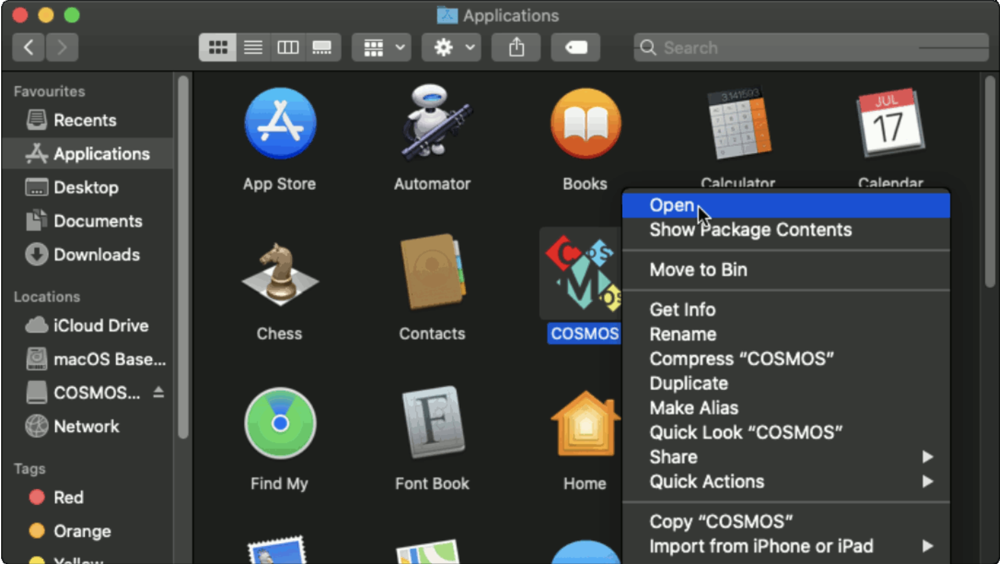{:height="300px" width="500px"}

- A confirmation dialog warns about unverified developer. In the dialog, click on
*Open* button.
////**ADD SCREENSHOT**
- As soon as you click *Open* button, a black pop-up window (Terminal) appears on the screen for **COSMOS self-check**. (Checkout the COSMOS self-check section below.)
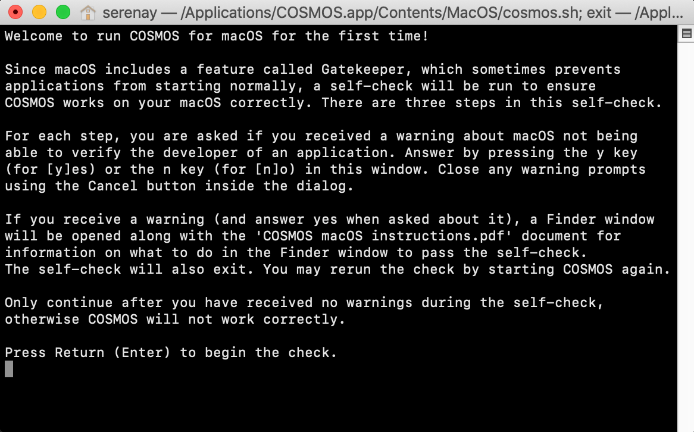{:height="300px" width="500px"}

 
**Note:** After launching the app for the first time, you may launch COSMOS from the Applications folder the way you would normally start applications.

#### 2. Starting COSMOS via a script from Finder
- Once you have downloaded the COSMOS package (the file name extension is tgz, tar.gz, or tar), double click the file in Finder and it will be automatically extracted.
- When you are about to run `Start COSMOS.command` for the first time, follow these steps as illustrated below:

    1. Right-click (Control-click) on the file and select Open from the context menu.
    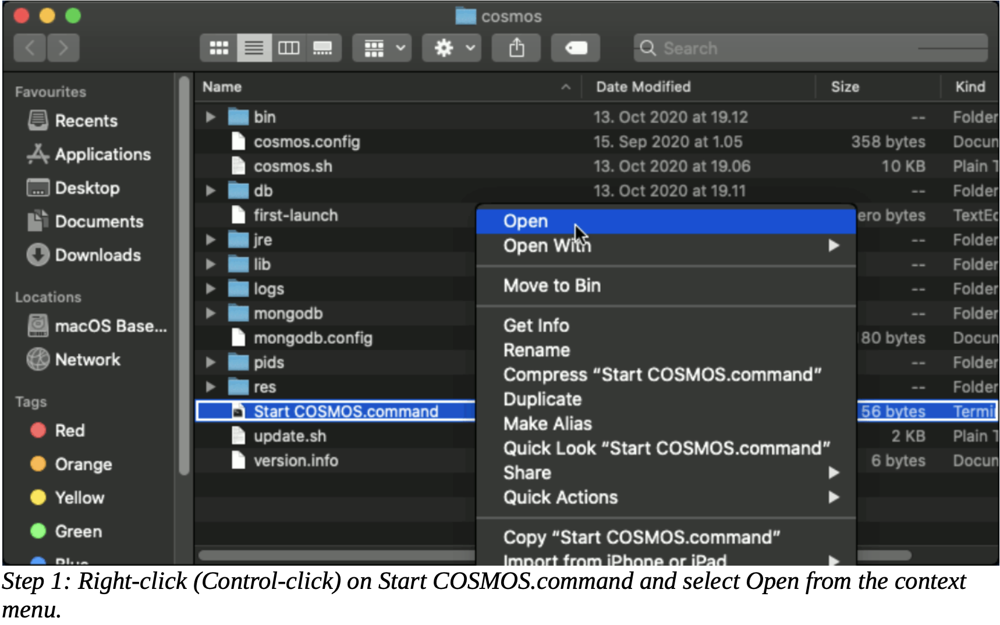{:height="300px" width="500px"}
    2. A confirmation dialog warns about unverified developer. In the dialog, click on **Open** and COSMOS will launch.
    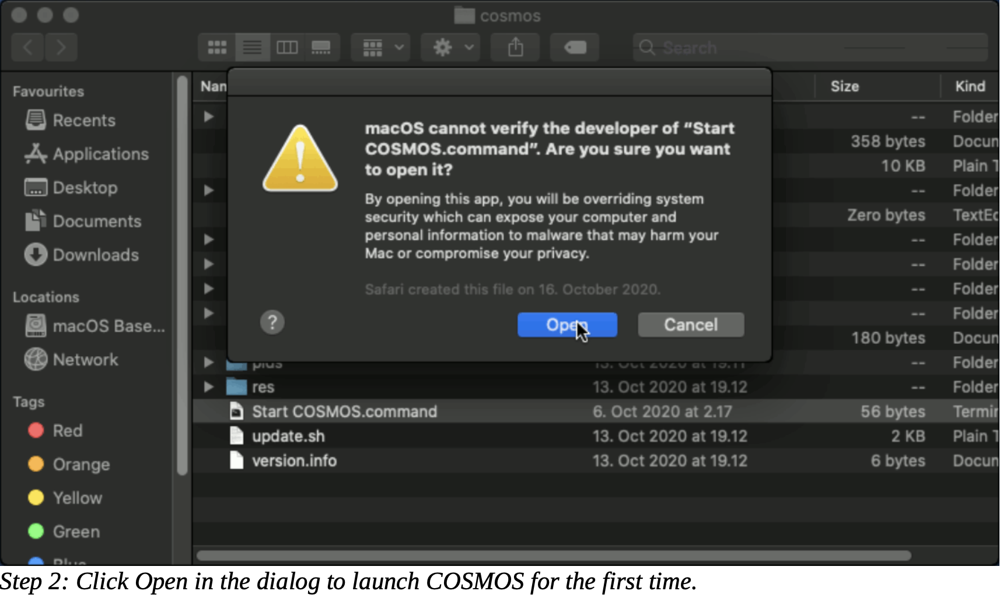{:height="300px" width="500px"}
    3. After the first run, you may launch COSMOS by simply double-clicking the Start COSMOS.command file in Finder. The permission to open it needs to be granted only once.

#### 3. COSMOS Self-Check:
- When you start COSMOS for the first time, a self-check is run to ensure that COSMOS runs correctly. 
- First of all, you need to press 'Enter' to begin the check as you inform on the Terminal window.
**ADD SCREENSHOT** 
- There are **three** steps in this self-check.
- For each step you will ask whether you saw a warning. If you did, the self-check will exit and you are presented with a Finder window open in the corresponding folder of the file.
**ADD SCREENSHOT** 

**Step 1:** Trying to run MongoDB. When you see the warning press 'y'. In the Finder window, right-click (Control-click) on the `mongod` file, and from the context menu, select **Open**. 

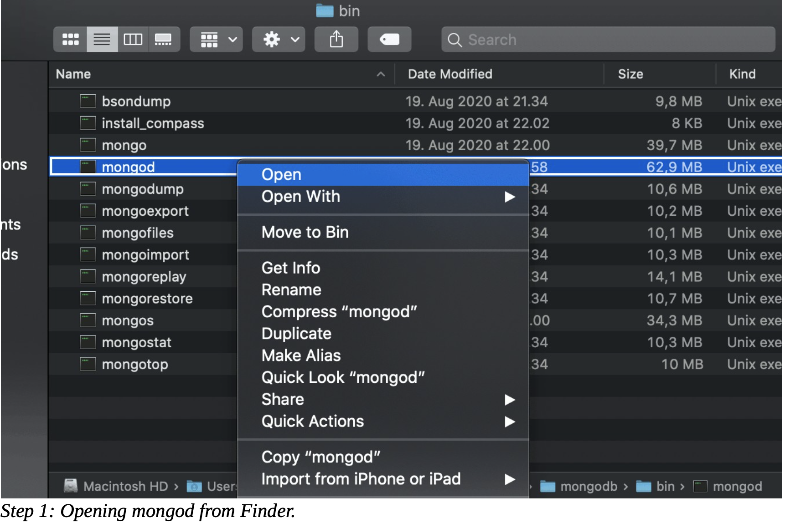{:height="300px" width="500px"}

After clicking **Open** from the context menu, you will receive a similar warning as before about unverified developer, but this time the dialogue has an *Open* button. Click it: this will grant permission to open the file also in the future.

**Step 2:** Trying to run Java. After granted the mongodb permission, you will be asked again whether you saw warning. Follow the same steps on mongodb, and right-click (Control-click) on the `java` file, and from the context menu, select **Open**. Click the *Open* on the unverified developer dialogue to grant the the java permission.

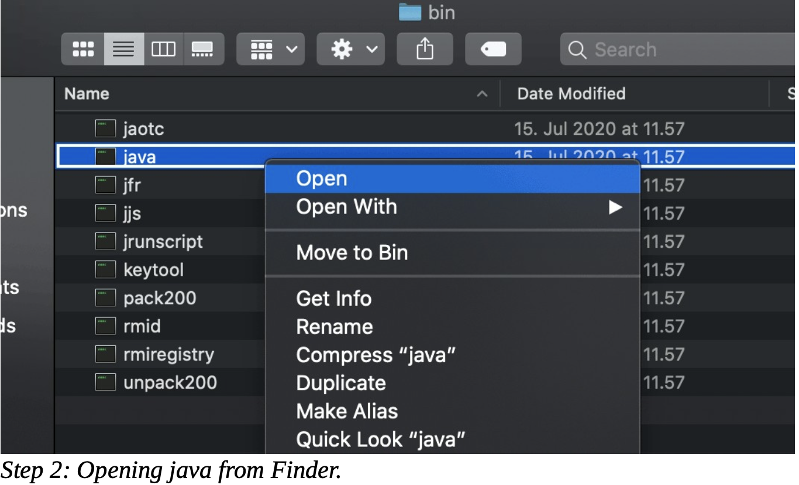{:height="300px" width="500px"}

**Step 3:**  Trying to run Network Node Centrality calculator. Last step of the self check repeat the same steps for `centrality-mac` file.

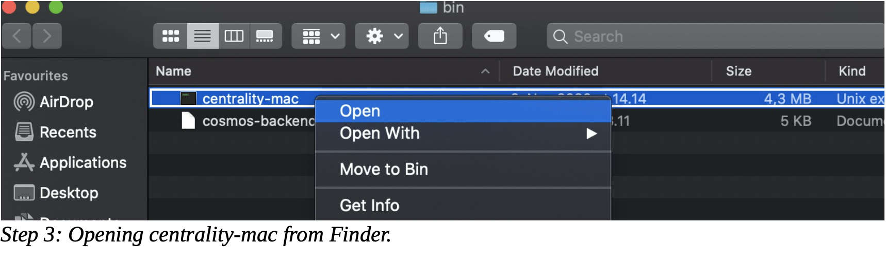{:height="200px" width="500px"}

After completed all steps of self-check, your internet browser will open automatically and COSMOS will run on your machine locally.

The self-check is only run the first time you start COSMOS. Once everything is set up correctly and necessary permissions are granted, COSMOS will run directly when you start it.

## Windows

To set up COSMOS on a Windows machine is easier than Mac. Once you have downloaded the compressed **COSMOS for 64-bit Microsoft Windows**
package:
- Unzip cosmos-windows_x86_64 folder.
- In this folder right-click *Start COSMOS.bat* file and click **Open** from the contex menu.
- When a pop-up window appears, click on *Extract all* to run application properly.
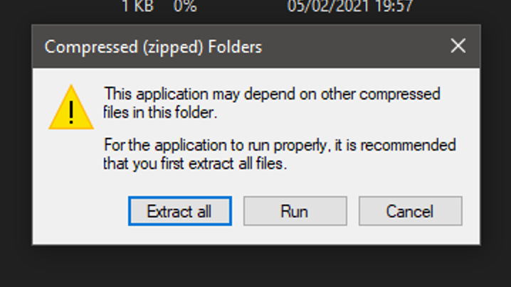{:height="300px" width="500px"}
- Then, right-click *Start COSMOS.bat* file and click **Open** again to start COSMOS.
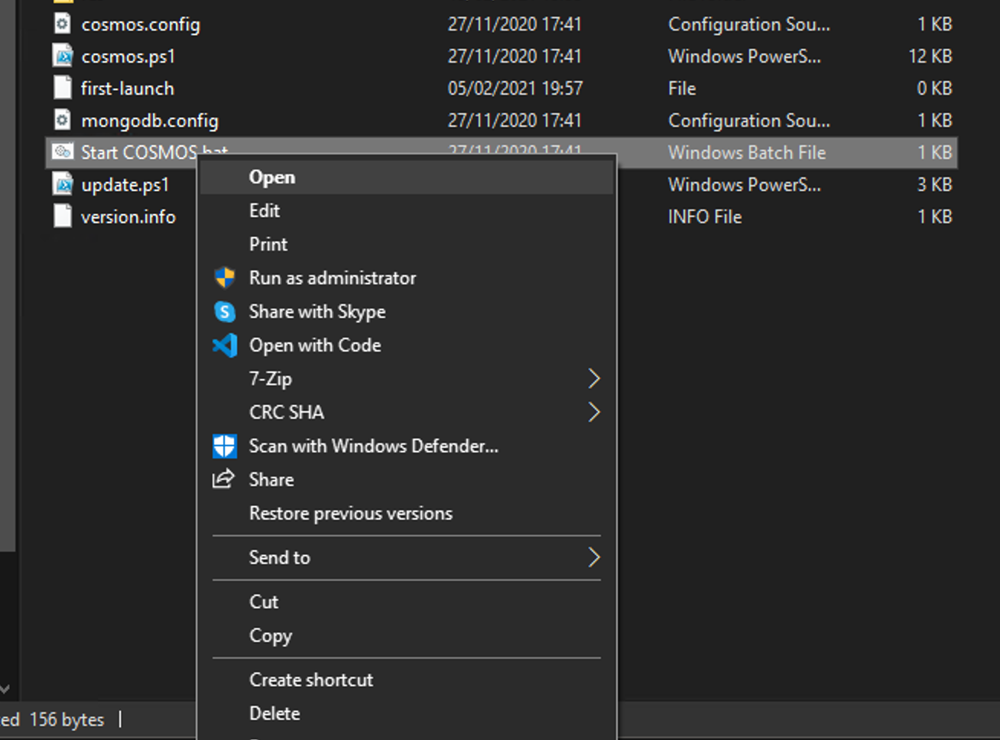{:height="300px" width="500px"}

- When you click **Open**, you will see the Terminal window and press **Return (Enter)** as it is instructed on this window.
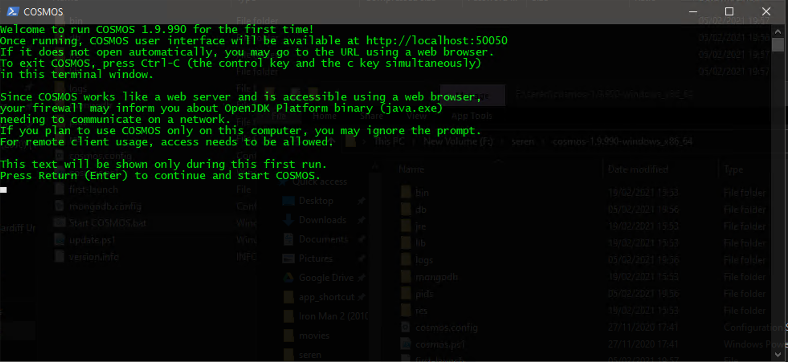{:height="300px" width="500px"}

- Finally, your internet browser will open automatically and COSMOS will run on your machine locally.
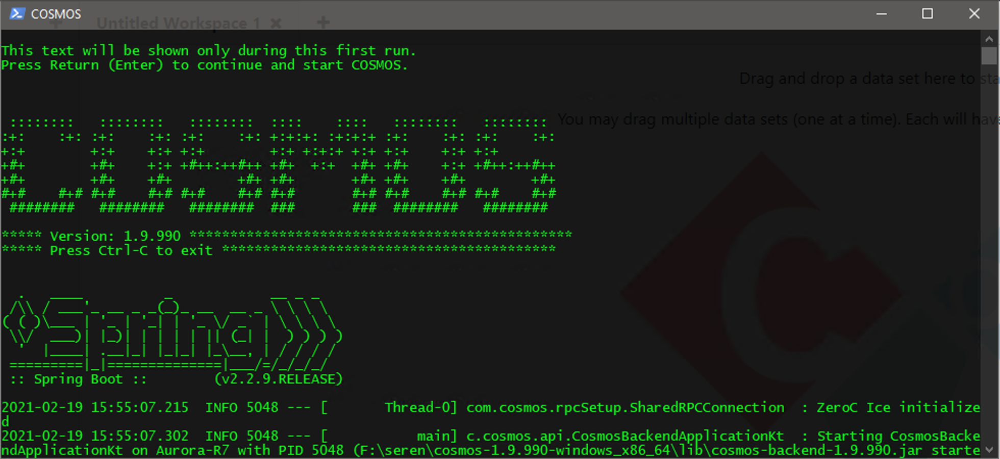{:height="300px" width="500px"}

 
> ## Warning!
> - When COSMOS is running, please do not close the terminal/cmd/powershell window.  
> - To exit COSMOS, please press 'CTRL+C' while you are on the terminal/cmd/powershell window. 
> - If you close Terminal window without pressing CTRL+C, the next time you try to run COSMOS, it will raise an error. See the illustration below.
> {:height="250px" width="450px"}
> - To solve this issue, press 'Enter' and CTRL+C to stop it.
>
{: .prereq}


